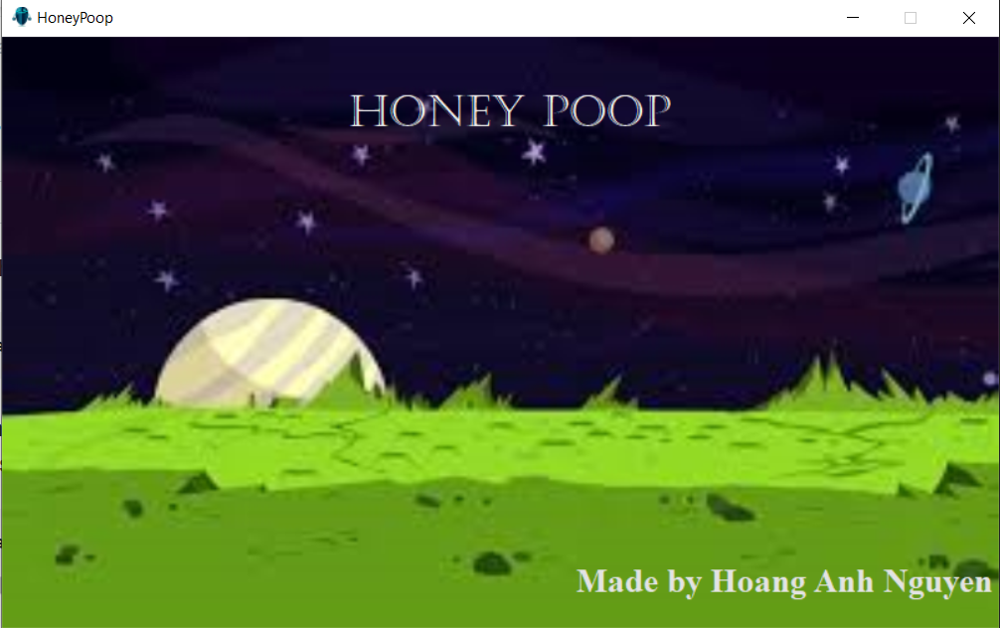
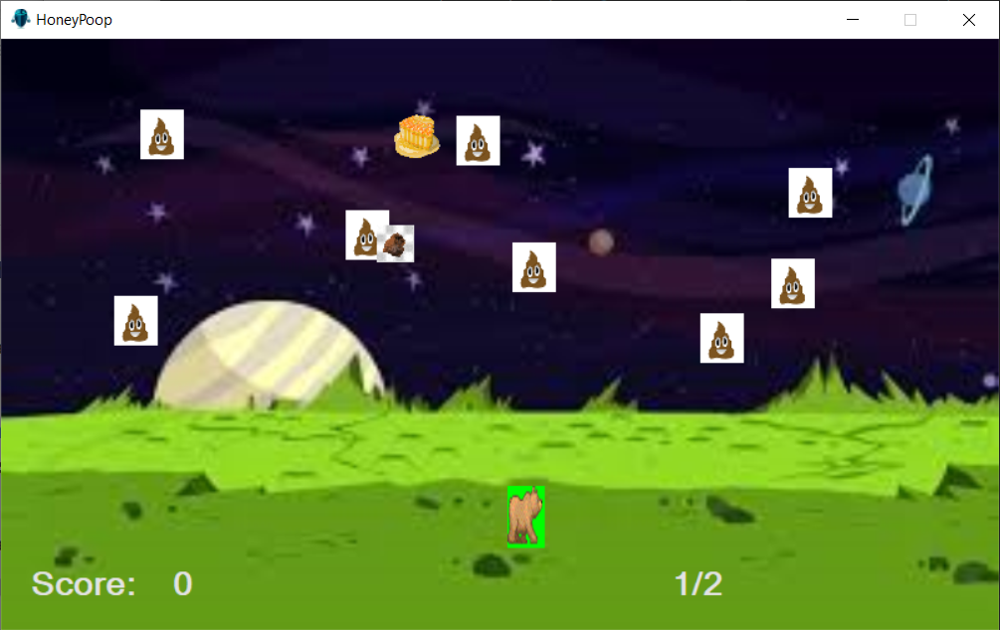
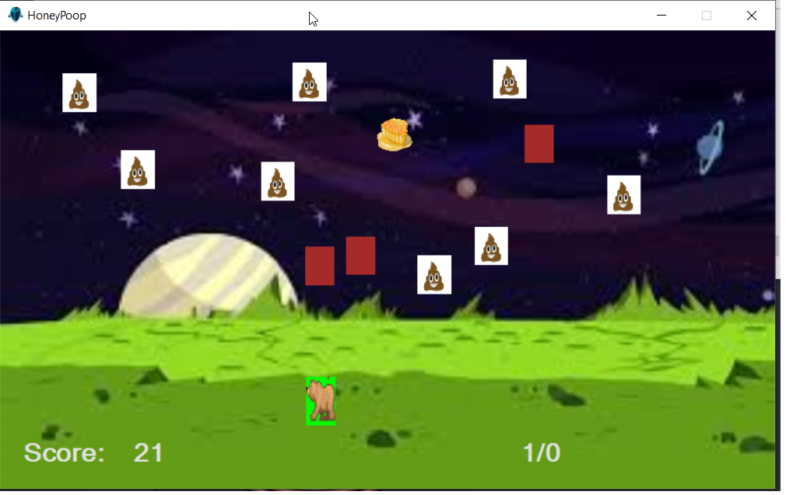

#Honey Pooper| THIS IS MY HIGH SCHOOL PROJECT, I'm VERY PROUD OF IT.
----------------------------------------------------------
# The Game featured bullet, obstacle, moving obstacle,target, score, and of course player.
----------------------------------------------------------
# How to play?
Collect the Honey

Collect the rock to add it into your inventory
# Controller
Press Enter to start the game
Left Arrow < to move left
Right Arrow > to move right
Space to shoot
UP Arrow to run straight to the honey to save bullet

Ammos are very limited, so use it wisely, at level 20 object will start to move. 

# The Goal of the game
have fun

# To open the game
Open HoneyPooper.exe

# Tool i used to make the game

Microsoft Visual Studio 2010 Professional <-- RIP

=======
Microsoft Visual Studio Form

All right reserved. - Kaney Nguyen
